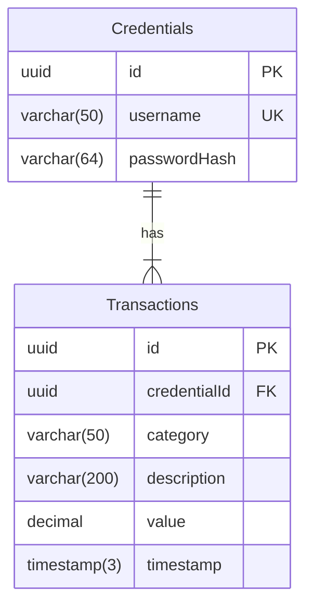

# Budget Tracking API database schema

```mermaid
erDiagram

Credentials {
    uuid id PK
    varchar(50) username UK
    varchar(64) passwordHash
}

Transactions {
    uuid id PK
    uuid credentialId FK
    varchar(50) category
    varchar(200) description
    decimal value
    timestamp(3) timestamp
}

Credentials ||--|{ Transactions: has

```
